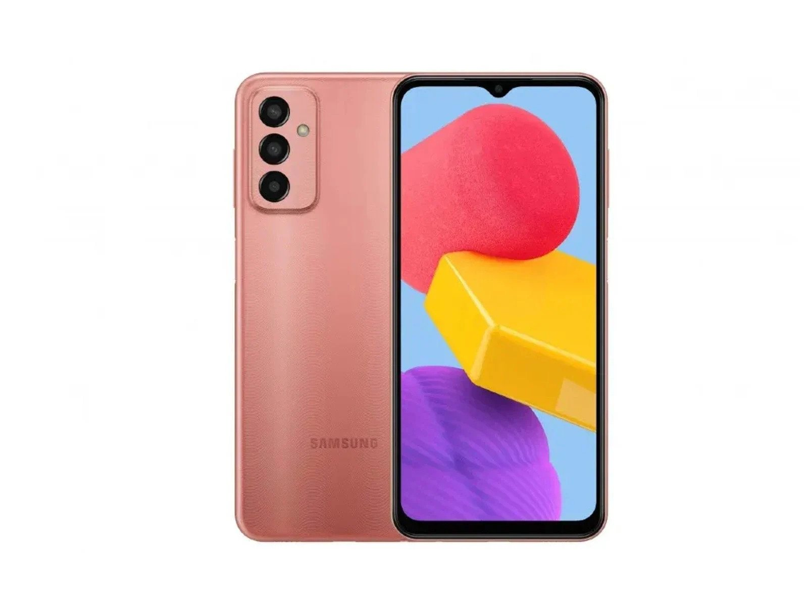

TWRP Device Tree for Samsung F13
===================================

The Samsung F13 (codename _"f13"_) have following parameters:

Basic                   | Spec Sheet
-----------------------:|:-------------------------
Chipset					| Exynos 850 (8nm)
CPU                     | Octa-core (4x2.0 GHz Cortex-A55 & 4x2.0 GHz Cortex-A55)
GPU                     | Mali-G52
Shipped OS				| Android 12, One UI Core 4.1
Memory                  | 64GB 4GB RAM or 128GB 4GB RAM, eMMC 5.1
MicroSD                 | microSDXC (dedicated slot)
Network                 | GSM / HSPA / LTE
Video                   | 1080p@30fps
USB                     | USB Type-C 2.0, OTG
Battery 				| Li-Po 6000 mAh, non-removable
Power                   | 15W




# Build

### clone `Minimal-Manifest-TWRP` and sync the repo:

```
$ repo init -u https://github.com/minimal-manifest-twrp/platform_manifest_twrp_aosp.git -b twrp-12.1
$ repo sync -c -j$(nproc --all) --force-sync --no-clone-bundle --no-tags
```

### clone twrp device tree to right place
```
$ git clone https://github.com/theshoqanebi/android_device_samsung_f13.git device/samsung/f13
```

### start build process:

```
$ . build/envsetup.sh
$ lunch twrp_f13-eng
$ mka -j$(nproc --all) adbd recoveryimage
```

# Installing:

### For Testing:
```
$ fastboot boot out/target/product/f13/recovery.img
```

### To Flash it via fastboot:
```
$ fastboot flash recovery recovery.img
```